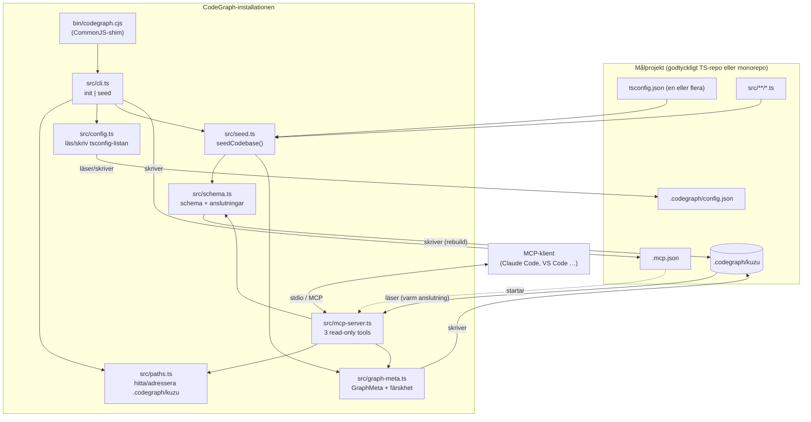
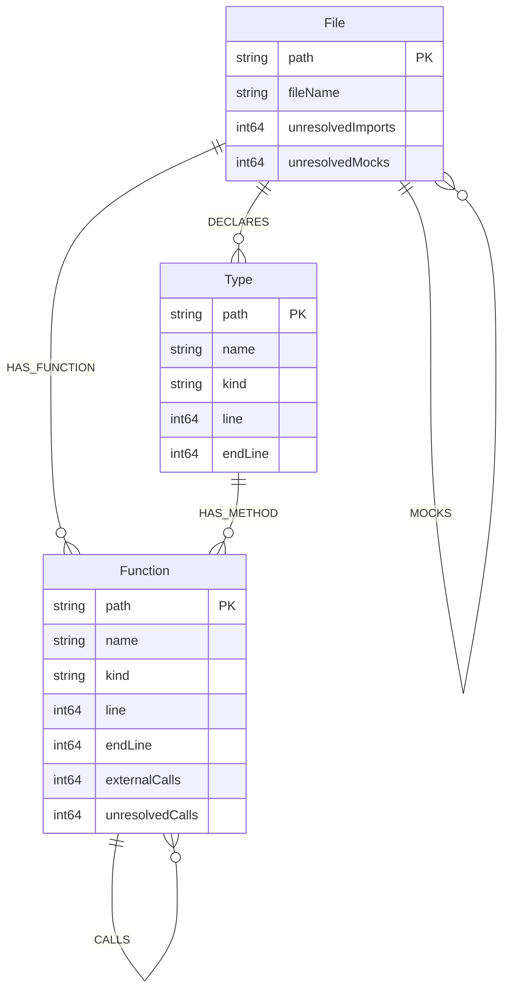
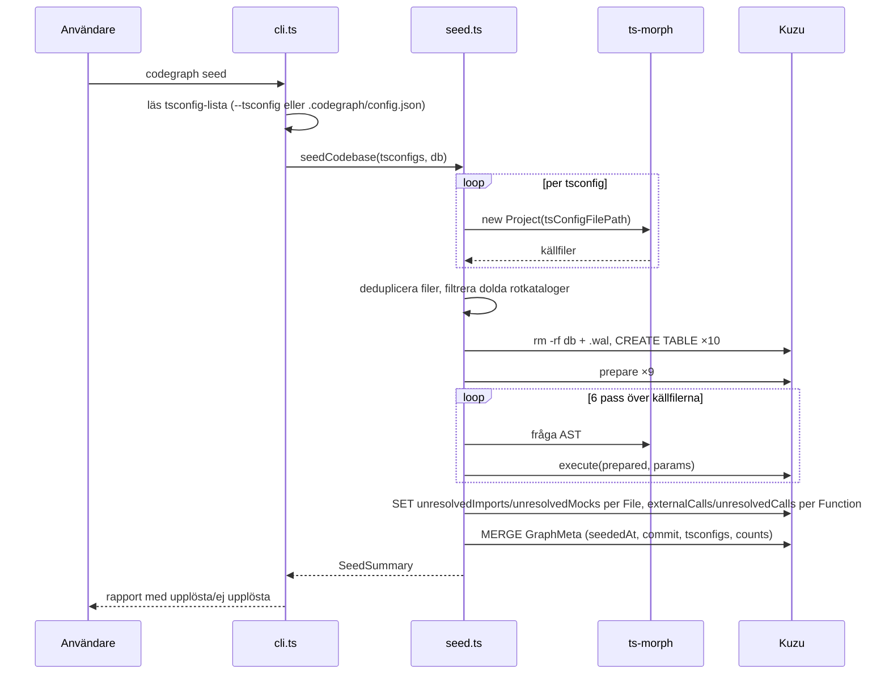
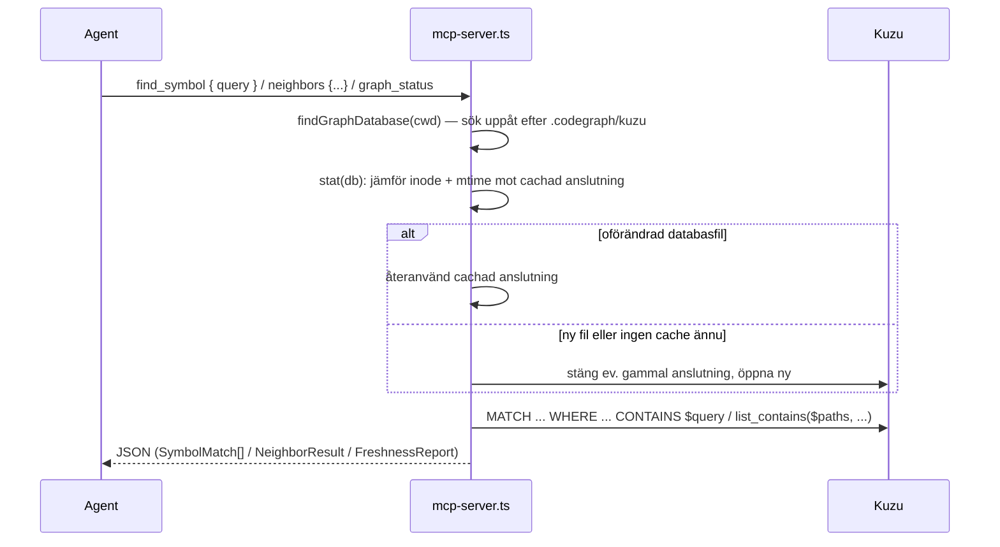

# CodeGraph — arkitektur

Dokumentet beskriver hur CodeGraph är byggt idag, vilka gränser som är avsiktliga och var systemet går att bygga vidare. Det är skrivet som kontextunderlag för den som ska ändra i koden eller för en agent som arbetar i repot.

Dokumentet beskriver den faktiska implementationen. Det uppdateras efter varje genomförd ändring, inte i förväg — planerat arbete ligger i [docs/superpowers/plans/](superpowers/plans/).

## 1. Vad systemet gör

CodeGraph läser ett eller flera TypeScript-projekt via deras `tsconfig.json` (en lista, för monorepos), extraherar strukturella fakta deterministiskt ur AST:n med `ts-morph`, och skriver dem till en inbäddad Kuzu-grafdatabas i `.codegraph/kuzu`. En MCP-server över stdio exponerar sedan ett litet antal skrivskyddade frågor mot grafen, så att en kodagent kan hitta en symbol via namn eller sökväg och sedan fråga vad den importerar, vem som importerar den, eller vem som anropar den — utan att söka igenom kodbasen med grep.

Grundpremissen: **grafen är ett index, inte en sanning.** Den byggs om från grunden vid varje seedning och kan vara inaktuell i samma sekund som en fil ändras. `graph_status` kan numera säga hur gammal grafen är och vilka `.ts`-filer som ändrats sedan seedningen — men det är en signal att agera på, inte ett bevis på att grafen stämmer. Verktygen är avsedda som en snabb strukturell signal före läsning av källkod, inte som ersättning för den.

## 2. Systemöversikt

Två processer, aldrig samtidigt aktiva mot samma databas i normalflödet:

| Process | Startas av | Åtkomst till grafen |
|---|---|---|
| Seedning (`codegraph init` / `codegraph seed`) | Användaren, manuellt | Full skrivrätt — raderar och bygger om |
| MCP-server (`src/mcp-server.ts`) | MCP-klienten | Endast läsning, via en varm cachad anslutning; öppnar aldrig ett saknat schema |

## 3. Moduler

### `src/paths.ts` — var grafen bor

Den enda regeln för var databasen ligger, delad av `cli.ts` och `mcp-server.ts` så att den ena aldrig skriver dit den andra inte läser:

- `graphDatabasePathFor(directory)` — den sökväg en graf *skulle* ha i en given katalog, oavsett om den finns.
- `findGraphDatabase(startDirectory)` — söker uppåt från `startDirectory` mot filsystemets rot, precis som git söker efter `.git`, och returnerar den närmaste `.codegraph/kuzu` som redan `existsSync`. `undefined` om ingen hittas.
- `searchedDirectories(startDirectory)` — samma kedja av kataloger, för felmeddelanden som visar exakt var sökningen tittade.

Detta ersätter miljövariabeln `CLAUDE_PROJECT_DIR`, som är borta: MCP-servern letar nu efter grafen själv i stället för att lita på att en viss MCP-klient sätter en leverantörsspecifik variabel korrekt, och samma mekanism fungerar oavsett vilken klient som startar processen.

Konsekvensen för monorepos: `codegraph seed` från en underkatalog hittar och återanvänder en graf längre upp i trädet i stället för att skapa en konkurrerande andra graf. `codegraph init` skapar däremot alltid grafen i katalogen kommandot körs från — det är den avsiktliga installationsgesten, och den enda av de två som inte söker uppåt först.

### `src/config.ts` — vilka tsconfig som ingår

`.codegraph/config.json` håller listan av tsconfig-sökvägar som ska seedas, lagrade **relativt projektroten** (aldrig absolut), så att filen kan checkas in och delas i teamet utan att bära med sig någons hemkatalog.

- `writeTsconfigPaths(projectRoot, tsconfigPaths)` — skriver konfigurationen, skapar `.codegraph/` om den saknas.
- `readTsconfigPaths(projectRoot)` — läser konfigurationen. Saknas filen (`ENOENT`) faller den tillbaka på `<projectRoot>/tsconfig.json` som enda post, så ett projekt utan `config.json` fortfarande fungerar. Finns filen men saknar en icke-tom `tsconfigs`-lista kastas ett fel i stället för att tyst seeda ingenting.

Just därför skriver `ensureGitignore` i `cli.ts` numera `.codegraph/kuzu*` i `.gitignore`, inte hela `.codegraph/`: den binära databasfilen (och dess `.wal`) ska förbli ignorerad, men `config.json` ska kunna committas.

### `src/graph-meta.ts` — färskhet

Ett `GraphMeta`-nodtabell i samma databas (`key`/`value`-par) håller fyra fält som alltid skrivs tillsammans, sist i en lyckad seedning: `seededAt`, `commit`, `tsconfigs` och `counts` (hela `SeedSummary` som JSON).

- `writeGraphMeta` — `MERGE`ar de fyra nycklarna.
- `readGraphMeta` — returnerar `undefined` om `GraphMeta`-tabellen saknas helt (en graf seedad före denna funktion fanns) **eller** finns men saknar någon av de fyra nycklarna (en seedning som kraschade halvvägs). Bägge fallen är "vi vet inte", aldrig tyst "frisk".
- `describeFreshness` — bygger på `readGraphMeta` och lägger till nuvarande `git rev-parse HEAD`, en diff mellan seedningens commit och nuvarande (`git diff --name-only`), och den ohanterade arbetskatalogen (`git status --porcelain`). Unionen av `.ts`/`.tsx`-filer i båda ger `changedFiles`; en icke-tom lista gör `stale: true`. Saknas metadata är svaret alltid `stale: true` med en förklarande `reason`, aldrig en gissning.

`git`-anropen är fångade: i en katalog som inte är ett gitrepo blir de tom sträng i stället för ett kastat fel, så färskhet degraderar snyggt även utanför git.

### `src/schema.ts` — datalager

Den enda modulen som äger schemadefinitionen. Två ingångar:

- `createGraphDatabase(path)` — skapar katalogen, öppnar databasen och kör alla tio `CREATE ... TABLE`-satser (`File`, `IMPORTS`, `MOCKS`, `Type`, `DECLARES`, `Function`, `HAS_FUNCTION`, `HAS_METHOD`, `CALLS`, `GraphMeta`). Används **bara** av seedningen och av `verify-kuzu`.
- `openGraphDatabase(path)` — öppnar en befintlig databas utan att röra schemat. Används av MCP-servern och av testerna.

`File` bär numera `unresolvedImports`/`unresolvedMocks` (`INT64`), `Type` och `Function` bär `line`/`endLine` (`INT64`, radintervallet för deklarationen), och `Function` bär dessutom `externalCalls` och `unresolvedCalls`. Alla skrivs vid `MERGE` och uppdateras senare med `SET` under seedningen (se `src/seed.ts` nedan).

Att anropsräknarna är två och inte en är ett medvetet val: `externalCalls` räknar anrop vars mottagare är deklarerad utanför de seedade filerna (`node_modules`, TypeScripts lib, ett annat projekt) — förväntat och omöjligt att åtgärda, eftersom en graf över dessa tsconfig-projekt aldrig kan innehålla de noderna. `unresolvedCalls` räknar det seedaren faktiskt missade. Slås de ihop dränks den enda siffra som säger något om grafens kvalitet i brus: i en riktig kodbas är förhållandet ungefär 2 000 externa mot 95 verkliga missar, och en läsare som ser ett samlat tal på 2 100 slutar rimligtvis lita på `CALLS` helt i onödan.

Hjälpare: `execute()` (kör och stänger ett resultat), `singleResult()` (Kuzu-bindningen kan returnera `QueryResult | QueryResult[]`; hjälparen normaliserar och kastar om antalet inte är exakt ett) och `closeGraphDatabase()`.

Två detaljer värda att känna till, oförändrade sedan tidigare:

- `CREATE NODE TABLE` körs **utan** `IF NOT EXISTS`. `createGraphDatabase` mot en befintlig databas misslyckas därför. Det är ofarligt idag eftersom seedningen alltid raderar katalogen först, men det gör funktionen icke-idempotent på egen hand.
- `DEFAULT_DATABASE_PATH` beräknas vid modulinladdning med `path.resolve(".codegraph/kuzu")`, alltså relativt processens `cwd` vid import. Alla nuvarande anropare skickar en explicit sökväg, så defaulten är i praktiken oanvänd — men den är en fälla för nästa anropare som förlitar sig på den.

### `src/seed.ts` — extraktion

`seedCodebase(tsconfigPaths: string[], databasePath: string)` är hela skrivvägen och är avsiktligt fri från CLI-beroenden, så den kan anropas direkt från tester. Databassökvägen är numera obligatorisk — ingen inbyggd default, anroparen (via `src/paths.ts`) avgör var grafen hamnar.

Sekvensen är:

1. Ladda varje `tsconfig.json` som ett eget `ts-morph`-`Project`. Deduplicera källfiler över alla projekt via `path` (`sourceFileByPath`), så att en fil som ingår i flera projekt besöks exakt en gång — annars skulle dess imports och funktioner dubbelräknas. Den resulterande `projectFilePaths`-mängden är **unionen** av alla projekts källfiler: imports och mocks löses mot den unionen, inte mot ett projekt i taget, vilket är precis det som gör en import mellan två paket i en monorepo till en kant i stället för en oupplöst räknare. Varje fil löses ändå med sitt **eget** projekts compiler-options (`projectByFilePath`), inte ett gemensamt.
2. Filtrera bort källfiler som ligger under en dold rotkatalog (`.generated/`, `.next/` …) via `isInHiddenRootDirectory`. Filtret tittar bara på **första** segmentet relativt filens eget projekts rot.
3. `rm -rf` databaskatalogen **och** dess `.wal`-fil, och skapa schemat på nytt.
4. Förbered nio parametriserade satser och kör sex sekventiella pass över källfilerna, följt av två uppdateringspass som skriver de per-nod-räknade `unresolved*`-talen.
5. Skriv `GraphMeta` och returnera en `SeedSummary`; stäng databasen i `finally`.

De sex extraktionspassen:

| Pass | Producerar | Upplösningsstrategi |
|---|---|---|
| Filer | `File` | En nod per källfil, `path` = absolut normaliserad sökväg |
| Imports | `IMPORTS` | `getModuleSpecifierSourceFile()`; målet måste ligga i unionen av alla projekts filer |
| Mocks | `MOCKS` | `ts.resolveModuleName()` med filens eget projekts compiler-options |
| Typer | `Type`, `DECLARES` | Klasser, interface och typalias på toppnivå (`kind`: `class` \| `interface` \| `typeAlias`) |
| Funktioner | `Function`, `HAS_FUNCTION`, `HAS_METHOD` | Namngivna toppnivåfunktioner, toppnivåkonstanter bundna till en arrow- eller funktionsuttrycksinitierare, och klassmetoder, med `line`/`endLine` |
| Anrop | `CALLS`, `externalCalls`, `unresolvedCalls` | Symbolupplösning via `getSymbol()` → `getAliasedSymbol()` → `getValueDeclaration()`, med `getDeclarations()[0]` som reserv |

Anropspasset bygger under funktionspasset en `Map<Node, { path, body }>` från AST-nod till nodens `path` och den kropp som ska skannas efter utgående anrop. Kartan nycklas på **deklarationen**, eftersom det är den typcheckaren lämnar tillbaka för en mottagare — för en arrow-funktion bunden till en `const` är det `VariableDeclaration`, aldrig arrow-noden själv. Ett anrop blir en kant **endast** om den upplösta deklarationen finns i kartan.

Misslyckas uppslaget klassificeras anropet i stället, och skillnaden mellan de två utfallen är hela poängen:

- **externt** — deklarationen finns, men i en fil utanför `projectFilePaths`. `getValueDeclaration()` är tom för allt som bara deklarerats som typ (ett frågebiblioteks kedjade metoder, vars `.d.ts` bär signaturer utan implementation), så reserven `getDeclarations()[0]` är det som gör att de känns igen som externa i stället för att bokföras som seedarens eget misslyckande.
- **oupplöst** — ingen deklaration alls (ett anrop genom `any`), eller en deklaration inne i de seedade filerna som inte indexeras som en `Function`-nod.

En koncis arrow-kropp (`const f = (v) => v.trim()`) **är** anropsuttrycket i stället för ett block som innehåller ett, så `callExpressionsIn()` tar med kroppsnoden själv — annars skulle varje anrop i den mycket vanliga formen tyst falla bort.

Mock-igenkänningen (`getMockModuleSpecifier`) matchar syntaktiskt på `vi.mock`, `vi.doMock`, `jest.mock`, `jest.doMock` med ett statiskt strängargument. Ingen typkontroll, inga variabla modulspecifikationer.

Två uppdateringspass, körda efter extraktionen, skriver de per-nod-räknade motparterna till aggregatsiffrorna i `SeedSummary`: `File.unresolvedImports`/`unresolvedMocks` och `Function.externalCalls`/`unresolvedCalls` sätts med `SET`, en gång per fil respektive funktion, från kartor byggda under de tidigare passen. Utan dem skulle frågelagret bara kunna säga "den här filen har inga `IMPORTS`-kanter" — vilket ser identiskt ut oavsett om filen faktiskt importerar ingenting, eller om allt den importerar var oupplösbart. Se §4 och §6 för hur `neighbors` använder detta.

Sist skrivs `GraphMeta`: seedningstidpunkt, git-commit (tomt om katalogen inte är ett gitrepo), den absoluta tsconfig-listan, och hela `SeedSummary` — grunden för `graph_status`.

### `src/mcp-server.ts` — frågelager

En `McpServer` över `StdioServerTransport` med tre verktyg:

| Verktyg | Vad det gör | Indata |
|---|---|---|
| `find_symbol` | Substrängsökning över `File.path`/`fileName`, `Type.path`/`name` och `Function.path`/`name`. Returnerar varje träff med exakt sökväg, `kind` och radintervall. | `query: string` (icke-tom) |
| `neighbors` | Expanderar en lista sökvägar längs valda kanttyper (`IMPORTS`, `MOCKS`, `CALLS`, `DECLARES`, `HAS_FUNCTION`, `HAS_METHOD`), riktning (`out`/`in`/`both`) och djup (1–3). | `paths: string[]` (1–50), `edges`, `direction` (default `out`), `depth` (default 1) |
| `graph_status` | Färskhetsrapport: seedningstid, commit, tsconfig-lista, ändrade `.ts`/`.tsx`-filer sedan dess, och databasens sökväg. | inga fält |

Detta ersätter de fyra gamla `get_file_*`-verktygen. Mönstret de använde — noll träffar ger fel, flera träffar ger en kandidatlista och grafen frågas aldrig, exakt en träff kör frågan — är medvetet överspelat: `find_symbol` returnerar alla träffar med sina exakta sökvägar, och anroparen klistrar in de exakta sökvägarna i `neighbors`. Ingen gissning vid tvetydighet, men heller ingen tvingad omfrågning vid flera kandidater.

`neighbors` vet vilka (kant, riktning) → nodtabell-kombinationer som är lagliga via en statisk `EDGE_SCHEMA`, hämtad direkt ur `schema.ts`'s `CREATE REL TABLE`-satser (t.ex. `IMPORTS`: `File`→`File`, `HAS_METHOD`: `Type`→`Function`). Frågeloopen konstruerar aldrig en kombination schemat inte tillåter — den provar och sväljer inte fel, den slår upp rätt tabell direkt. Svaret innehåller alltid `counts` per given sökväg: `null` betyder att räknaren inte gäller den nodtypen (en `Function` har ingen `unresolvedImports`), ett tal betyder att den faktiskt mättes — även om värdet är 0. `externalCalls` hålls isär från `unresolvedCalls` av samma skäl som i schemat (§3): ett stort tal i den förra är förväntat och säger inget om grafen. Filnivåns bägge anropssummor är dessutom riktiga körtidssummor, inte lagrade kolumner: de summerar över filens egna funktioner (`HAS_FUNCTION`) **och** över metoderna på typer filen deklarerar (`DECLARES`→`HAS_METHOD`). `unknownPaths` listar sökvägar som inte matchar någon nod alls — skilt från en sökväg som matchar en nod utan grannar.

`getDatabasePath()` anropar `findGraphDatabase(process.cwd())` — samma uppåtsökande upplösning som CLI:t använder, delad via `src/paths.ts`. Hittas ingen graf kastas ett fel som listar varje uppsökt katalog och pekar mot `codegraph init`.

`withConnection` cachar databas och anslutning mellan anrop i stället för att öppna och stänga per verktygsanrop. Före varje anrop `stat`:as databasfilen och jämförs mot den cachade anslutningen på **både** inode och mtime; skiljer sig någotdera stängs den gamla anslutningen och en ny öppnas. En öppning av en 26 MB Kuzu-fil kostar cirka 37 ms, en `stat` kostar mikrosekunder — cachen gör varma frågor billiga utan att riskera att servera en graf som seedats om under tiden (Kuzu tar inget exklusivt lås, så seedaren kan skriva medan servern lever).

Varje anrop till `withConnection` köas bakom föregående via en promise-kedja, eftersom MCP-SDK:t dispatchar verktygsanrop utan att invänta att föregående är klart — två anrop kan alltså vara i flykt samtidigt. Kuzus `connection.close()` koordinerar inte med en pågående fråga: utan serialisering kan ett anrop som upptäcker en omseedning stänga den delade anslutningen medan ett annat fortfarande frågar mot den, vilket kraschar hela processen med ett native-undantag i stället för ett fångbart fel (belagt i `test/warm-connection-smoke.ts`). Serialiseringen kostar i praktiken inget — en varm fråga tar omkring 0,5 ms.

### `src/cli.ts` + `bin/codegraph.cjs` — installation

`bin/codegraph.cjs` är en CommonJS-shim som `spawnSync`:ar CodeGraphs **egen** medföljande `tsx` mot `src/cli.ts` och ärver stdio. Därför behövs ingen global `tsx`-installation, och CLI:t kan köras från vilket projekt som helst efter `npm link`.

`codegraph init` körs från målprojektets rot och gör fyra saker:

1. Kräver att varje angiven (eller default `<cwd>/tsconfig.json`) `tsconfig.json` finns. `--tsconfig` kan upprepas: `codegraph init --tsconfig tsconfig.json --tsconfig packages/pdf/tsconfig.json`.
2. Lägger till `.codegraph/kuzu*` i `.gitignore` om raden saknas.
3. Skriver eller uppdaterar `.mcp.json` med posten `codegraph` — bevarar övriga servrar genom att läsa in, mutera och skriva tillbaka.
4. Skriver tsconfig-listan till `.codegraph/config.json` och kör en första seedning mot `graphDatabasePathFor(projectRoot)`.

`codegraph seed` kräver och seedar likadant, men läser tsconfig-listan från `--tsconfig`-flaggor om de angetts, annars från `.codegraph/config.json` via `readTsconfigPaths`, och seedar mot `findGraphDatabase(projectRoot) ?? initDatabasePath` — den befintliga grafen längre upp i katalogträdet om en redan finns, annars samma plats `init` skulle ha skapat den.

Sökvägarna i `.mcp.json` pekar tillbaka på CodeGraph-installationen (`packageRoot`), medan `cwd` sätts till målprojektet. Kommandot skrivs som bara `"node"` snarare än en absolut sökväg — kommentaren i koden förklarar varför: den absoluta node-sökvägen varierar mellan terminaler och versionshanterare på samma maskin.

### `src/verify-kuzu.ts` — kompatibilitetskontroll

Ett fristående smoke-test som skapar en tillfällig databas, kör `RETURN 1`, verifierar svaret och städar upp. Syftet är att fånga ABI-inkompatibilitet i den nativa Kuzu-bindningen *innan* något annat körs. Kör det först när Node-versionen eller Kuzu-versionen ändras.

## 4. Datamodell

Utöver dessa fyra tabeller finns `GraphMeta` — enkla `key`/`value`-rader för seedningsmetadata, inte en del av kodgrafens struktur (se `src/graph-meta.ts` i §3).

Identitet är den bärande designregeln — allt identifieras av sökväg, aldrig av enbart namn:

| Nod | `path` | `kind` |
|---|---|---|
| `File` | `/abs/väg/till/fil.ts` | — |
| `Type` | `/abs/väg/fil.ts:Klassnamn` | `class` \| `interface` \| `typeAlias` |
| `Function` (fristående) | `/abs/väg/fil.ts:funktionsnamn` | `function` |
| `Function` (arrow-konstant) | `/abs/väg/fil.ts:konstantnamn` | `function` |
| `Function` (metod) | `/abs/väg/fil.ts:Klassnamn.metodnamn` | `method` |

`File.fileName` lagrar basnamnet, vilket gör det billigt att presentera och gruppera träffar utan strängbearbetning i frågelagret.

`line`/`endLine` på `Type` och `Function` är deklarationens radintervall (`getStartLineNumber()`/`getEndLineNumber()`), skrivet direkt vid `MERGE`. Det är vad som gör det möjligt att peka en agent mot exakta rader i stället för hela filen (se `find_symbol` i §3).

`File.unresolvedImports`/`unresolvedMocks` och `Function.externalCalls`/`unresolvedCalls` persisteras direkt på noden — skrivna med `SET` efter respektive extraktionspass, inte beräknade vid frågetillfället. Det är vad som gör det möjligt att skilja "den här filen importerar ärligt talat ingenting" från "allt den försökte importera gick inte att slå upp": en tom `IMPORTS`-lista tillsammans med `unresolvedImports: 0` är den förra, tillsammans med `unresolvedImports: 3` är den senare.

## 5. Flöden

### Seedning

Seedningen är idempotent genom **rebuild**, inte genom diffning: databaskatalogen (och dess `.wal`) raderas, schemat återskapas, och varje kant skrivs med `MERGE` så att dubbletter inom en körning kollapsar. Två körningar mot oförändrad källkod ger identisk graf. Priset är att det inte finns någon inkrementell uppdatering — hela projektmängden läses om varje gång.

### Fråga

Anropet köas bakom eventuellt pågående anrop innan det når anslutningen (se `withConnection` i §3), så en omseedning som pågår mitt i en session upptäcks av nästa köade anrop utan att någon fråga korsar en stängd anslutning.

## 6. Säkerhets- och integritetsgränser

Fem invarianter håller systemet inom sin avsedda roll. De är alla lätta att råka bryta i en till synes harmlös utvidgning.

1. **Ingen godtycklig Cypher över MCP.** Frågorna är hårdkodade i serverkoden. Ett generellt `run_cypher`-verktyg skulle ge en klient full läs- *och skrivåtkomst* och upphäva hela read-only-gränsen.
2. **Alla klientvärden binds som parametrar**, aldrig via stränginterpolation — utom identifierare, som per definition inte kan bindas (kant-/relationsnamn, riktning, nodtabell). De interpoleras, men uteslutande från slutna, serverdefinierade mängder som valideras vid körning, aldrig från fritext: relationsnamnet kommer från `EDGE_TYPES`, riktningen från `DIRECTIONS` (`"out" | "in" | "both"`), och nodtabellen slås upp i `EDGE_SCHEMA` — den statiska tabell (kant, riktning) → nodtabell som är hämtad direkt ur `schema.ts`'s `CREATE REL TABLE`-satser. `queryNeighbors` kontrollerar dessutom edge, direction och depth mot dessa mängder själv, inte bara via Zod-schemat i verktygsregistreringen, eftersom funktionen också anropas direkt (från tester, och i princip av framtida anropare förbi stdio-gränsen). Söksträngen i `find_symbol` och sökvägslistan i `neighbors` (`$paths`, bunden via `list_contains($paths, source.path)`) är vanliga parametrar. Behåll formen: går relationstyp, riktning eller nodtabell någonsin att sätta fritt utifrån måste den mappas genom en allowlist innan den interpoleras.
3. **MCP-servern skapar aldrig schemat.** `getDatabasePath()` letar bara efter en redan existerande graf via `findGraphDatabase` (som kontrollerar `existsSync` innan den returnerar en sökväg) och anropar sedan `openGraphDatabase`, aldrig `createGraphDatabase`. En saknad graf ger ett handlingsbart fel som räknar upp de uppsökta katalogerna, inte en tom databas som ser giltig ut.
4. **`stdout` tillhör MCP-protokollet.** All loggning från servern går till `stderr` (se `console.error` i `main()`). Ett enda `console.log` i frågevägen korrumperar protokollströmmen.
5. **Den delade, cachade anslutningen serialiseras.** MCP-SDK:t dispatchar verktygsanrop utan att invänta föregående, så flera `withConnection`-anrop kan vara i flykt samtidigt. Utan den promise-kedja som köar dem kan ett anrop som upptäcker en omseedning stänga en anslutning som ett annat anrop fortfarande frågar mot — inte ett fångbart fel, utan en native-krasch i hela processen. Serialiseringen är vad som gör det säkert att alls cacha anslutningen mellan anrop.

## 7. Kända begränsningar

Avsiktliga avgränsningar för PoC:en:

- **Transitiva frågor finns, men med hårt tak.** `neighbors` stöder numera variabellånga stigar (`depth` 1–3) tack vare Kuzus stöd för det, men djupet är begränsat till tre steg och det finns ingen cykeldetektering eller obegränsad sökning.
- **Ingen inkrementell uppdatering.** Ingen file watcher, ingen delvis omseedning. Grafen åldras mellan körningar, men det finns nu ett verktyg (`graph_status`) som säger hur mycket och varför.
- **Externa paket modelleras inte.** `import path from "node:path"` räknas som `unresolvedImports`. Det är förväntat, inte ett fel. Detsamma gäller korspaketimporter som TypeScript löser mot en byggd `.d.ts`-fil i stället för källan (t.ex. ett workspace-paket som bara publicerar sin `dist/`): den upplösta filen ligger utanför den seedade käll-mängden och räknas som oupplöst, precis som ett riktigt externt paket. `declarationMap`-baserad upplösning tillbaka till källan finns inte.

Begränsningar som är konsekvenser av implementationen snarare än designval, och som är värda att känna till innan man litar på siffrorna eller resultaten:

- **`CALLS` täcker tre deklarationsformer.** Funktionsdeklarationer, klassmetoder och toppnivåkonstanter med en arrow- eller funktionsuttrycksinitierare. En arrow-funktion i en **nästlad** scope, en metod i ett objektliteral, och anrop utanför någon av dessa kroppar (toppnivåkod, klassfältsinitierare) blir aldrig kanter — de räknas som `unresolvedCalls` respektive räknas inte alls.
- **Destrukturerade importbindningar löses inte.** `const { createInvoice } = await import(...)` ger en `BindingElement` som inte finns i deklarationskartan, så anropet räknas som oupplöst även när målet ligger i grafen.
- **`externalCalls` beror på var TypeScript hittar deklarationen, inte på vad som faktiskt körs.** Ett workspace-paket som löses mot en byggd `.d.ts` i stället för sin källa räknas som externt, precis som ett riktigt npm-paket.
- **TypeScript-överlagringar dubbelräknas.** `getFunctions()` returnerar både överlagringssignaturerna och implementationen. De delar `path`, så `MERGE` kollapsar dem till en nod korrekt — men `SeedSummary.functions` räknar varje deklaration.
- **Kollision vid deklarationssammanslagning.** En klass och ett interface med samma namn i samma fil ger samma `Type.path` med olika `kind` och bryter mot primärnyckeln.
- **Mock-passet skannar allt.** `getDescendantsOfKind(CallExpression)` körs över varje källfil, inte bara testfiler.
- **Substrängsmatchning saknar ankare och stemming.** Matchningen är skiftlägesokänslig (`lower()` på bägge sidor), men fortfarande ren delsträng: en sökning på `"app.ts"` i `find_symbol` matchar även `myapp.ts` och `app.test.ts`, och en sökning på `party` hittar aldrig `parties` — den precisionen är oförändrad från tidigare, bara flyttad från `resolveFileQuery` till `find_symbol`. Dessutom har `find_symbol` ingen resultatgräns: en enteckens-sökning kan i princip serialisera hela grafen till ett enda svar.
- **En fil i flera projekts include-mönster tar tyst det första projektets compiler-options.** `projectByFilePath` sparar bara den första matchningen (`!projectByFilePath.has(filePath)`); i en monorepo med olika `strict`-inställningar per paket kan det ge en annan upplösning än den agenten förväntar sig, utan varning.
- **`ensureGitignore` migrerar inte en äldre installation.** Om `.gitignore` redan har den gamla, breda raden `.codegraph/` från en tidigare version av CodeGraph läggs den nya `.codegraph/kuzu*`-raden ändå till, men den gamla raden tas inte bort — `.codegraph/config.json` förblir då ignorerat och går inte att committa, utan att verktyget säger något.
- **`main()`-vakten i `mcp-server.ts` avgör om processen ska starta transporten genom att kontrollera att `process.argv[1]` slutar på `"mcp-server.ts"`.** Korrekt så länge `build` är `tsc --noEmit` och filen alltid körs via `tsx` mot källfilen — men bräckligt den dag JS faktiskt emitteras och filen heter `mcp-server.js`, eller bunt(l)as till något annat namn.
- **Namnbytta filer förvanskas i `changedFiles`.** `describeFreshness` tar de tre första tecknen bort från varje rad i `git status --porcelain` för att få fram filnamnet. En omdöpt fil (`R  gammal-fil.ts -> ny-fil.ts`) ger då en enda felformad post i stället för två giltiga sökvägar.
- **Metodhalvan av filnivåns `unresolvedCalls`-summa saknar egen testfixtur.** Rollupen i `neighbors` summerar över både `HAS_FUNCTION` och `DECLARES`→`HAS_METHOD`, men testsviten övar bara den första halvan (en fristående funktion) — metodbidraget till samma summa har aldrig ett eget assert.
- **`seed.ts` och `mcp-server.ts` härleder git-projektroten på olika djup.** `seed.ts` kör `git`-kommandon med `path.dirname(databasePath)` som `cwd` — en nivå upp, alltså `.codegraph`-katalogen själv. `graph_status` i `mcp-server.ts` använder `path.dirname(path.dirname(databasePath))` — två nivåer upp, den faktiska projektroten. Det fungerar bara för att `git` självt söker uppåt efter `.git` oavsett startkatalog; skulle den sökningen någonsin sluta göra det skulle bägge tysta gå sönder på olika sätt.

## 8. Test

| Test | Kommando | Täcker |
|---|---|---|
| `src/verify-kuzu.ts` | `npm run verify:kuzu` | Att den nativa Kuzu-bindningen laddar och svarar. Körs separat, inte del av `npm test`. |
| `test/paths-smoke.ts` | `npm run test:paths` | `findGraphDatabase`s uppåtsökning: ingen graf hittas när ingen finns, en rotgraf hittas från en djup underkatalog, en närmare graf vinner över en längre bort, `graphDatabasePathFor` kräver inte att målet existerar, och `searchedDirectories` räknar upp hela kedjan ner till filsystemroten. |
| `test/seed-smoke.ts` | `npm run test:seed` | Hela seedvägen mot `test/fixtures/imports`: `SeedSummary` jämförs exakt fält för fält (inklusive `externalCalls`/`unresolvedCalls`, och att en arrow-konstant blir en `Function`-nod vars koncisa kropp skannas), `IMPORTS`-, `DECLARES`- (med `line`/`endLine` och `typeAlias`), `CALLS`- och `unresolvedImports`/`unresolvedMocks`-kanterna verifieras med egna Cypher-frågor. Skapar också en `.generated/ignored.ts` för att bevisa att filtret för dolda rotkataloger fungerar. |
| `test/monorepo-smoke.ts` | `npm run test:monorepo` | Multi-tsconfig-upplösning: seedas bara app-projektet blir en korspaketimport en `unresolvedImports`-räknare; seedas app- och core-projektet tillsammans blir samma import en riktig `IMPORTS`-kant. |
| `test/graph-meta-smoke.ts` | `npm run test:meta` | Fyra fall för `graph-meta.ts`: `GraphMeta` speglar exakt vad `seedCodebase` skrev; ett riktigt, isolerat gitrepo bevisar att `stale`/`changedFiles` faktiskt reagerar på en okommitterad ändring; en tom `GraphMeta`-tabell och en helt saknad `GraphMeta`-tabell degraderar bägge till `stale: true` med en `reason`, aldrig en krasch eller ett falskt "fräsch". |
| `test/tools-smoke.ts` | `npm run test:tools` | `findSymbol` och `queryNeighbors` direkt: radintervall i träffar, skiftlägesokänslig matchning, `counts`-fält som skiljer `null` (ej tillämplig) från ett uppmätt tal (inklusive 0) och externa anrop från verkliga missar, `unknownPaths` för sökvägar som inte matchar någon nod, och att interpolationsvakten faktiskt kastar för en icke-enum-kanttyp, en icke-enum-riktning och ett icke-heltaligt djup. |
| `test/warm-connection-smoke.ts` | `npm run test:warm` | Den varma anslutningen i `withConnection`: en andra fråga återanvänder cachen, en omseedning upptäcks via inode/mtime och nästa fråga ser den nya grafen, och en samtidighetslast (tio parallella anrop som racear en omseedning, två varv) varken kraschar processen eller lämnar kvar en föråldrad graf — varje anrop lyckas eller misslyckas rent med ett fångbart `Error`. |
| — | `npm test` | Kör `test:paths`, `test:seed`, `test:monorepo`, `test:meta`, `test:tools` och `test:warm` i tur och ordning. |
| — | `npm run build` | `tsc --noEmit` över `src/` och `test/`. |

Fixturen i `test/fixtures/imports` är avsiktligt minimal och täcker varje kantfall en gång: två lokala imports, en oupplösbar Node-import, en klass, ett interface, ett typalias, en fristående funktion, en metod som anropar samma funktion, och en `vi.mock(...)` som pekar mot ett icke-installerat paket. `test/fixtures/monorepo` lägger till två små projekt (`apps/web`, `packages/core`) med exakt en korspaketimport mellan sig, för att isolera multi-tsconfig-upplösningen.

## 9. Naturliga nästa steg

Medvetet **utanför** den här omgången, med skälen bakom varje beslut att vänta:

1. **FTS-index.** Kuzu har en fulltextextension som troligen löser merparten av de sökningar `find_symbol`s ankarlösa substrängsmatchning missar. Vänta tills det syns i praktiken var `find_symbol` faktiskt går bet, i stället för att gissa i förväg.
2. **Embeddings / vektorindex.** Verifierat att Kuzu 0.11.3 klarar det i samma databas. Men eftersom hela grafen byggs om från grunden vid varje seedning skulle embeddings betyda omembedding varje gång — antingen en innehållshash-cache utanför databasfilen, eller en inkrementell seedningsmodell. Ett eget projekt, inte "steget efter FTS".
3. **Inkrementell seedning.** Kräver kaskaderande radering av `File`-noder och ett mtime- eller hash-index som inte finns idag. Förutsättning för punkt 2 ovan, inte för något i den här planen.
4. **CLI-query-kommandon.** Skulle ge komponerbarhet i ett enda Bash-anrop, men bygger ett andra frågelager parallellt med MCP-verktygen, kräver att `tsx` kompileras bort för att bli snabb nog, och kräver att agenten känner till att CLI:t finns. `neighbors` med en sökvägslista ger redan det mesta av samma batchning inom en mekanism som redan är upptäckbar via MCP.
5. **Skill-lager för routing mellan grep och grafen.** En tidigare utvärdering såg en agent välja grep även med grafverktyg tillgängliga. En konkurrerande förklaring till den vanan är att grep *returnerar innehåll* medan den gamla grafen bara returnerade *sökvägar* — en affordansbrist snarare än en vanebrist, och `find_symbol`/`neighbors` med radintervall åtgärdar just den affordansen. Mät om reflexen finns kvar innan ett sådant skill skrivs; annars skrivs halva innehållet som kompensation för något som redan är löst.

Utöver dessa: de implementationskonsekvenser som listas i §7 (`.d.ts`→källa, `ensureGitignore`-migrering, `find_symbol`s saknade resultatgräns, `main()`-vaktens beroende av filnamnet, med flera) är kända och oåtgärdade punktinsatser snarare än nästa steg i någon särskild ordning — plocka den som blir relevant när den faktiskt stör.
