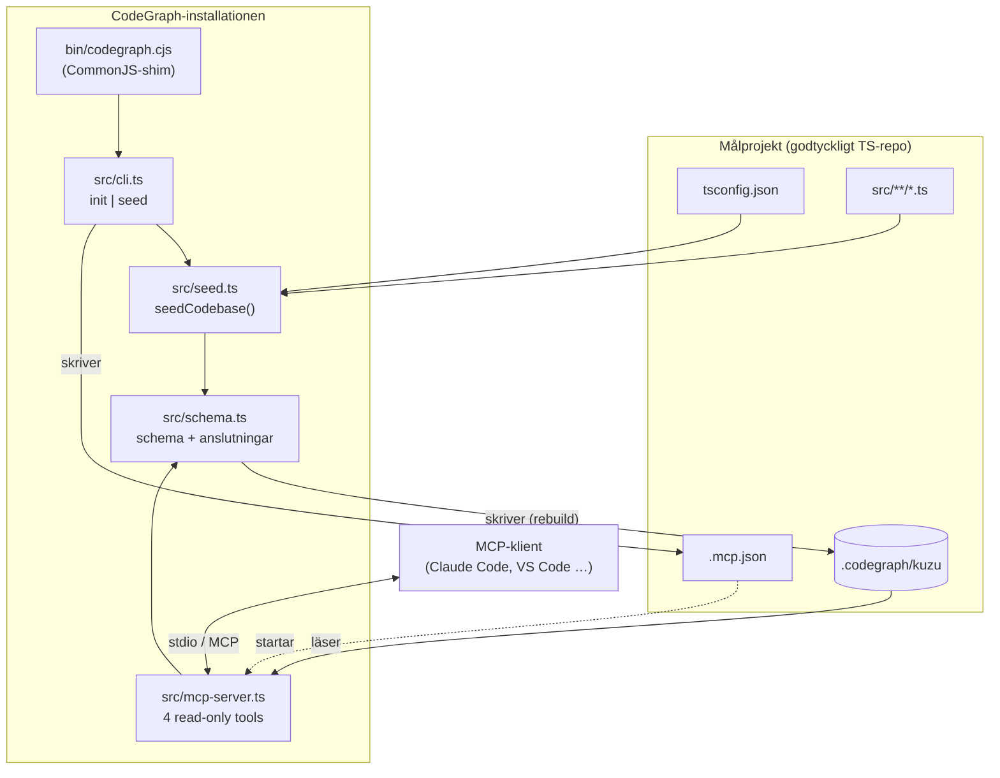
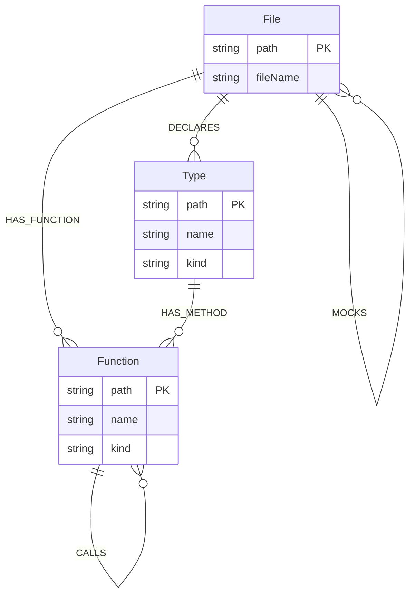
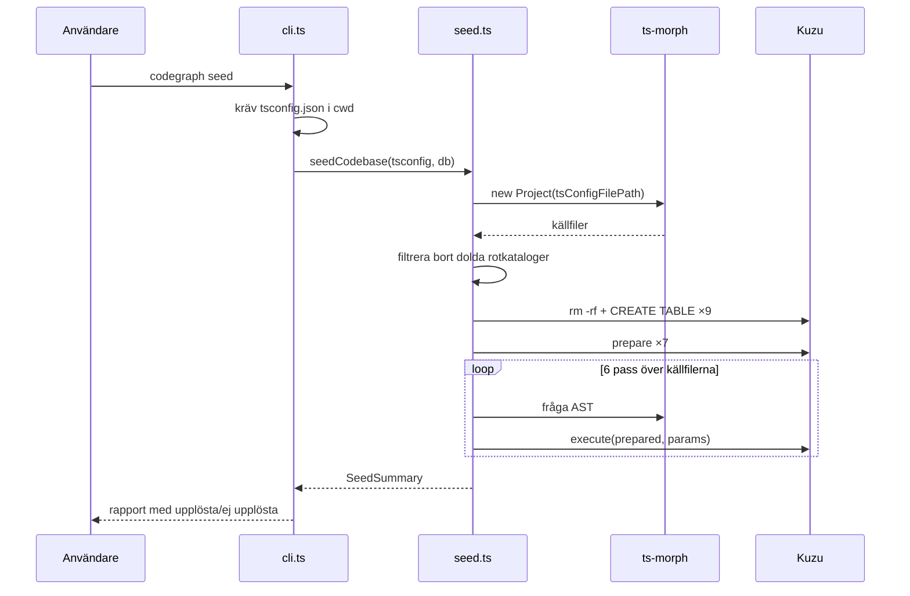
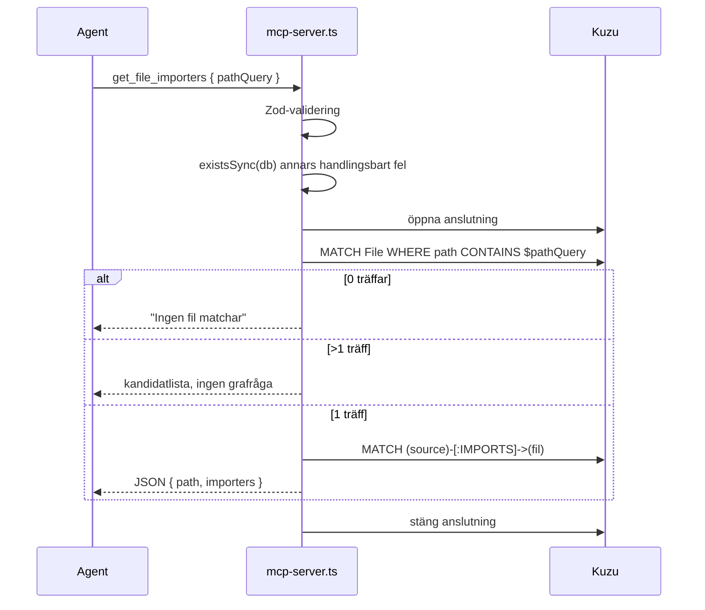

# CodeGraph — arkitektur

Dokumentet beskriver hur CodeGraph är byggt idag, vilka gränser som är avsiktliga och var systemet går att bygga vidare. Det är skrivet som kontextunderlag för den som ska ändra i koden eller för en agent som arbetar i repot.

Dokumentet beskriver den faktiska implementationen. Det uppdateras efter varje genomförd ändring, inte i förväg — planerat arbete ligger i [docs/superpowers/plans/](superpowers/plans/).

## 1. Vad systemet gör

CodeGraph läser ett TypeScript-projekt via dess `tsconfig.json`, extraherar strukturella fakta deterministiskt ur AST:n med `ts-morph`, och skriver dem till en inbäddad Kuzu-grafdatabas i projektets `.codegraph/kuzu`. En MCP-server över stdio exponerar sedan ett litet antal skrivskyddade frågor mot grafen, så att en kodagent kan fråga "vad importerar den här filen" och "vem importerar den" utan att söka igenom kodbasen med grep.

Grundpremissen: **grafen är ett index, inte en sanning.** Den byggs om från grunden vid varje seedning och kan vara inaktuell i samma sekund som en fil ändras. Verktygen är avsedda som en snabb strukturell signal före läsning av källkod, inte som ersättning för den.

## 2. Systemöversikt

Två processer, aldrig samtidigt aktiva mot samma databas i normalflödet:

| Process | Startas av | Åtkomst till grafen |
|---|---|---|
| Seedning (`codegraph init` / `codegraph seed`) | Användaren, manuellt | Full skrivrätt — raderar och bygger om |
| MCP-server (`src/mcp-server.ts`) | MCP-klienten | Endast läsning, öppnar aldrig ett saknat schema |

## 3. Moduler

### `src/schema.ts` — datalager

Den enda modulen som äger schemadefinitionen. Två ingångar:

- `createGraphDatabase(path)` — skapar katalogen, öppnar databasen och kör alla `CREATE ... TABLE`-satser. Används **bara** av seedningen och av `verify-kuzu`.
- `openGraphDatabase(path)` — öppnar en befintlig databas utan att röra schemat. Används av MCP-servern och av testerna.

Hjälpare: `execute()` (kör och stänger ett resultat), `singleResult()` (Kuzu-bindningen kan returnera `QueryResult | QueryResult[]`; hjälparen normaliserar och kastar om antalet inte är exakt ett) och `closeGraphDatabase()`.

Två detaljer värda att känna till:

- `CREATE NODE TABLE` körs **utan** `IF NOT EXISTS`. `createGraphDatabase` mot en befintlig databas misslyckas därför. Det är ofarligt idag eftersom seedningen alltid raderar katalogen först, men det gör funktionen icke-idempotent på egen hand.
- `DEFAULT_DATABASE_PATH` beräknas vid modulinladdning med `path.resolve(".codegraph/kuzu")`, alltså relativt processens `cwd` vid import. Alla nuvarande anropare skickar en explicit sökväg, så defaulten är i praktiken oanvänd — men den är en fälla för nästa anropare som förlitar sig på den.

### `src/seed.ts` — extraktion

`seedCodebase(tsconfigPath, databasePath?)` är hela skrivvägen och är avsiktligt fri från CLI-beroenden, så den kan anropas direkt från tester.

Sekvensen är:

1. Lös upp sökvägar. Databasen defaultar till `<tsconfig-katalog>/.codegraph/kuzu`.
2. Ladda projektet med `new Project({ tsConfigFilePath })`.
3. Filtrera bort källfiler som ligger under en dold rotkatalog (`.generated/`, `.next/` …) via `isInHiddenRootDirectory`. Filtret tittar bara på **första** segmentet relativt projektroten.
4. `rm -rf` databaskatalogen och skapa schemat på nytt.
5. Förbered sju parametriserade satser och kör sedan sex sekventiella pass över källfilerna.
6. Returnera en `SeedSummary` och stäng databasen i `finally`.

De sex passen:

| Pass | Producerar | Upplösningsstrategi |
|---|---|---|
| Filer | `File` | En nod per källfil, `path` = absolut normaliserad sökväg |
| Imports | `IMPORTS` | `getModuleSpecifierSourceFile()`; målet måste ligga i projektets filmängd |
| Mocks | `MOCKS` | `ts.resolveModuleName()` med projektets compiler-options |
| Typer | `Type`, `DECLARES` | Klasser och interface på toppnivå |
| Funktioner | `Function`, `HAS_FUNCTION`, `HAS_METHOD` | Namngivna toppnivåfunktioner och klassmetoder |
| Anrop | `CALLS` | Symbolupplösning via `getSymbol()` → `getAliasedSymbol()` → `getValueDeclaration()` |

Anropspasset bygger under funktionspasset en `Map<FunctionDeclaration | MethodDeclaration, string>` från AST-nod till nodens `path`. Den kartan är hela nyckeln till `CALLS`: ett anrop blir en kant **endast** om den upplösta deklarationen finns i kartan. Alltså projektövergripande upplösning, men bara mot de två deklarationsformer som modelleras.

Mock-igenkänningen (`getMockModuleSpecifier`) matchar syntaktiskt på `vi.mock`, `vi.doMock`, `jest.mock`, `jest.doMock` med ett statiskt strängargument. Ingen typkontroll, inga variabla modulspecifikationer.

### `src/mcp-server.ts` — frågelager

En `McpServer` över `StdioServerTransport` med fyra verktyg, alla med samma indataschema `{ pathQuery: string }` (Zod, `min(1)`):

| Verktyg | Relation | Riktning |
|---|---|---|
| `get_file_dependencies` | `IMPORTS` | utgående |
| `get_file_importers` | `IMPORTS` | inkommande |
| `get_file_mocks` | `MOCKS` | utgående |
| `get_file_mocked_by` | `MOCKS` | inkommande |

Alla fyra går genom `resolveFileQuery`, som implementerar den centrala tvåstegsupplösningen:

1. `findMatchingFiles` — substrängsmatchning (`file.path CONTAINS $pathQuery`).
2. Noll träffar → förklarande text. **Flera träffar → kandidatlista, och grafen frågas inte.** Exakt en träff → kör relationsfrågan och returnera JSON.

Att vägra gissa vid tvetydighet är ett medvetet val: en agent som får fel fil tyst tar fel beslut, en agent som får en kandidatlista ställer om frågan.

`getDatabasePath()` läser `CLAUDE_PROJECT_DIR` med fallback till `cwd`. Det gör att servern följer med den aktiva kodbasen under Claude Code, men bindningen till just den variabeln är leverantörsspecifik — andra MCP-klienter måste sätta rätt `cwd`.

`withConnection` öppnar och stänger databasen per verktygsanrop. Ingen delad, långlivad anslutning. Det betyder att en omseedning mitt under en session tas upp direkt av nästa anrop, till priset av öppningskostnad per fråga.

### `src/cli.ts` + `bin/codegraph.cjs` — installation

`bin/codegraph.cjs` är en CommonJS-shim som `spawnSync`:ar CodeGraphs **egen** medföljande `tsx` mot `src/cli.ts` och ärver stdio. Därför behövs ingen global `tsx`-installation, och CLI:t kan köras från vilket projekt som helst efter `npm link`.

`codegraph init` körs från målprojektets rot och gör fyra saker:

1. Kräver att `tsconfig.json` finns i `cwd`.
2. Lägger till `.codegraph/` i `.gitignore` om raden saknas.
3. Skriver eller uppdaterar `.mcp.json` med posten `codegraph` — bevarar övriga servrar genom att läsa in, mutera och skriva tillbaka.
4. Kör en första seedning.

`codegraph seed` gör bara steg 1 och 4.

Sökvägarna i `.mcp.json` pekar tillbaka på CodeGraph-installationen (`packageRoot`), medan `cwd` sätts till målprojektet. Kommandot skrivs som bara `"node"` snarare än en absolut sökväg — kommentaren i koden förklarar varför: den absoluta node-sökvägen varierar mellan terminaler och versionshanterare på samma maskin.

### `src/verify-kuzu.ts` — kompatibilitetskontroll

Ett fristående smoke-test som skapar en tillfällig databas, kör `RETURN 1`, verifierar svaret och städar upp. Syftet är att fånga ABI-inkompatibilitet i den nativa Kuzu-bindningen *innan* något annat körs. Kör det först när Node-versionen eller Kuzu-versionen ändras.

## 4. Datamodell

Identitet är den bärande designregeln — allt identifieras av sökväg, aldrig av enbart namn:

| Nod | `path` | `kind` |
|---|---|---|
| `File` | `/abs/väg/till/fil.ts` | — |
| `Type` | `/abs/väg/fil.ts:Klassnamn` | `class` \| `interface` |
| `Function` (fristående) | `/abs/väg/fil.ts:funktionsnamn` | `function` |
| `Function` (metod) | `/abs/väg/fil.ts:Klassnamn.metodnamn` | `method` |

`File.fileName` lagrar basnamnet, vilket gör det billigt att presentera och gruppera träffar utan strängbearbetning i frågelagret.

## 5. Flöden

### Seedning

Seedningen är idempotent genom **rebuild**, inte genom diffning: databaskatalogen raderas, schemat återskapas, och varje kant skrivs med `MERGE` så att dubbletter inom en körning kollapsar. Två körningar mot oförändrad källkod ger identisk graf. Priset är att det inte finns någon inkrementell uppdatering — hela projektet läses om varje gång.

### Fråga

## 6. Säkerhets- och integritetsgränser

Fyra invarianter håller systemet inom sin avsedda roll. De är alla lätta att råka bryta i en till synes harmlös utvidgning.

1. **Ingen godtycklig Cypher över MCP.** Frågorna är hårdkodade i serverkoden. Ett generellt `run_cypher`-verktyg skulle ge en klient full läs- *och skrivåtkomst* och upphäva hela read-only-gränsen.
2. **Alla klientvärden binds som parametrar**, aldrig via stränginterpolation. Undantaget är relationsnamnet i `findRelatedFiles`, som interpoleras — men det kommer från en sluten TypeScript-union (`"IMPORTS" | "MOCKS"`) satt av serverkoden, aldrig från klienten. Behåll den formen: om relationstypen någon gång ska kunna komma utifrån måste den mappas genom en allowlist.
3. **MCP-servern skapar aldrig schemat.** Den anropar `openGraphDatabase`, inte `createGraphDatabase`, och kontrollerar `existsSync` först. En saknad graf ska ge ett handlingsbart fel, inte en tom databas som ser giltig ut.
4. **`stdout` tillhör MCP-protokollet.** All loggning från servern går till `stderr` (se `console.error` i `main()`). Ett enda `console.log` i frågevägen korrumperar protokollströmmen.

## 7. Kända begränsningar

Avsiktliga avgränsningar för PoC:en:

- **Endast direkta relationer.** Inga transitiva beroenden, inga cykeldetekteringar. Kuzus stöd för variabellånga sökvägar finns men exponeras inte.
- **Ingen inkrementell uppdatering.** Ingen file watcher, ingen delvis omseedning. Grafen åldras tyst mellan körningar och det finns inget verktyg som avslöjar hur gammal den är.
- **Ett `tsconfig.json` per körning.** Ingen monorepo-hantering, inget stöd för TypeScript `paths`-alias utöver vad `ts-morph` löser upp självt.
- **Externa paket modelleras inte.** `import path from "node:path"` räknas som `unresolvedImports`. Det är förväntat, inte ett fel.

Begränsningar som är konsekvenser av implementationen snarare än designval, och som är värda att känna till innan man litar på siffrorna:

- **`unresolvedCalls` är brus, inte en felsignal.** Varje `console.log`, varje anrop till en arrow-funktion i en `const`, varje biblioteksanrop räknas in. Ett högt tal betyder inget i sig.
- **`CALLS` täcker bara två deklarationsformer.** `const f = () => {}` och anrop utanför en funktions- eller metodkropp (toppnivåkod, klassfältsinitierare) blir aldrig kanter.
- **TypeScript-överlagringar dubbelräknas.** `getFunctions()` returnerar både överlagringssignaturerna och implementationen. De delar `path`, så `MERGE` kollapsar dem till en nod korrekt — men `SeedSummary.functions` räknar varje deklaration.
- **Kollision vid deklarationssammanslagning.** En klass och ett interface med samma namn i samma fil ger samma `Type.path` med olika `kind` och bryter mot primärnyckeln.
- **Mock-passet skannar allt.** `getDescendantsOfKind(CallExpression)` körs över varje källfil, inte bara testfiler.
- **En databasrundtur per nod och kant, sekventiellt.** Fullt tillräckligt för PoC-storlek, men det är den första flaskhalsen på ett stort repo.
- **Substrängsmatchning saknar ankare.** `pathQuery: "app.ts"` matchar även `myapp.ts` och `app.test.ts`. Kandidatlistan gör det hanterbart men inte precist.

## 8. Test

| Test | Kommando | Täcker |
|---|---|---|
| `src/verify-kuzu.ts` | `npm run verify:kuzu` | Att den nativa Kuzu-bindningen laddar och svarar |
| `test/seed-smoke.ts` | `npm run test:seed` | Hela seedvägen mot `test/fixtures/imports` |
| — | `npm run build` | `tsc --noEmit` över `src/` och `test/` |

`seed-smoke` är det verkliga regressionsskyddet. Det seedar fixturen till en temporär databas, jämför hela `SeedSummary` exakt, och verifierar sedan `IMPORTS`-, `DECLARES`- och `CALLS`-kanterna med egna Cypher-frågor. Det skapar också en `.generated/ignored.ts` för att bevisa att filtret för dolda rotkataloger fungerar, och städar upp båda i `finally`.

Fixturen i `test/fixtures/imports` är avsiktligt minimal och täcker varje kantfall en gång: två lokala imports, en oupplösbar Node-import, en klass, ett interface, en fristående funktion och en metod som anropar samma funktion.

> **Notera:** `test/anders.ts` är en föråldrad kopia av smoke-testet. Den påstår en `SeedSummary` med tre fält (schemat har nio), pekar `databasePath` till `../.codegraph/kuzu` i stället för sin temporärkatalog, och städar aldrig upp den. Den ingår inte i något npm-skript. Antingen ta bort filen eller synka den — som den står nu misslyckas den och skriver utanför sin sandlåda.

## 9. Naturliga nästa steg

I ungefär den ordning de bygger på varandra:

1. **`graph_status`-verktyg** — seedningstidpunkt, käll-`tsconfig`, nod- och kantantal. Den enskilt största luckan idag: en agent har ingen möjlighet att se om grafen är inaktuell.
2. **Symbolnoder med stabil identitet** `filePath:symbolName:kind`, som grund för export-, arvs- och implementationsrelationer.
3. **Transitiva frågor** över `IMPORTS` med djupgräns — Kuzus variabellånga sökvägar gör detta billigt.
4. **Monorepo-stöd** — flera `tsconfig.json` i en körning, plus `paths`-alias.
5. **Inkrementell seedning** — kräver att `File`-noder kan raderas kaskaderande, vilket i sin tur kräver ett mtime- eller hash-index som inte finns idag.
